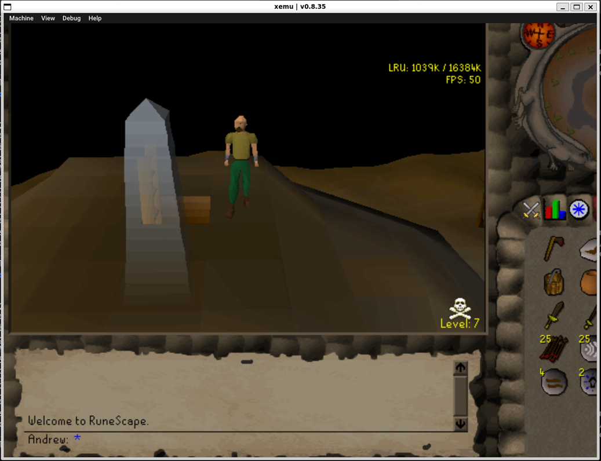
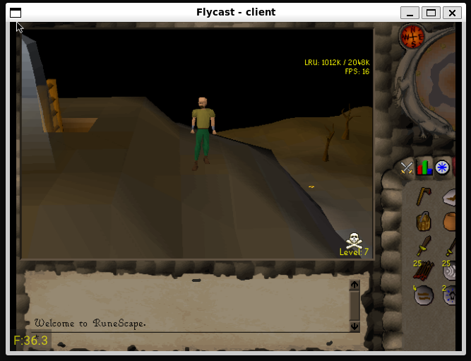
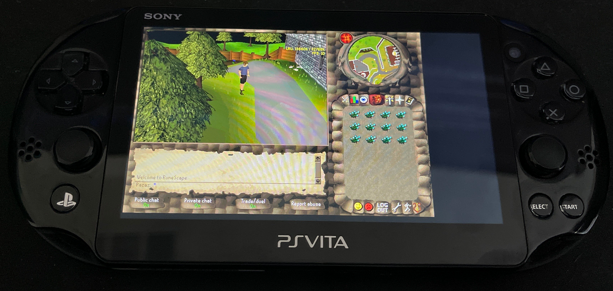
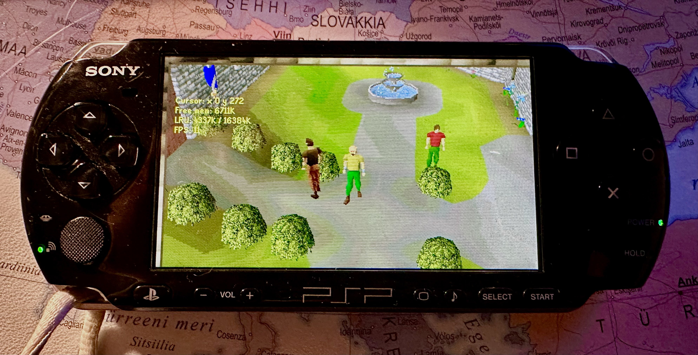
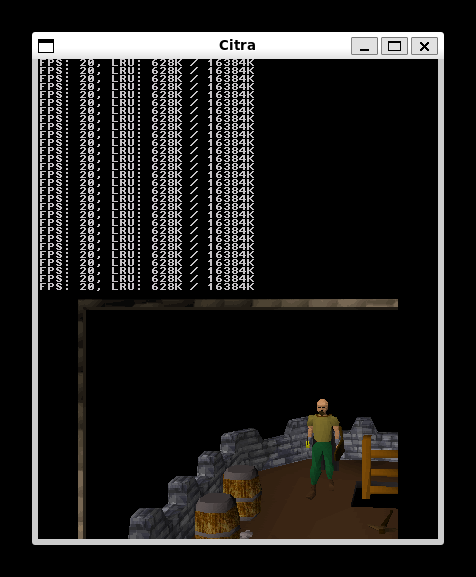
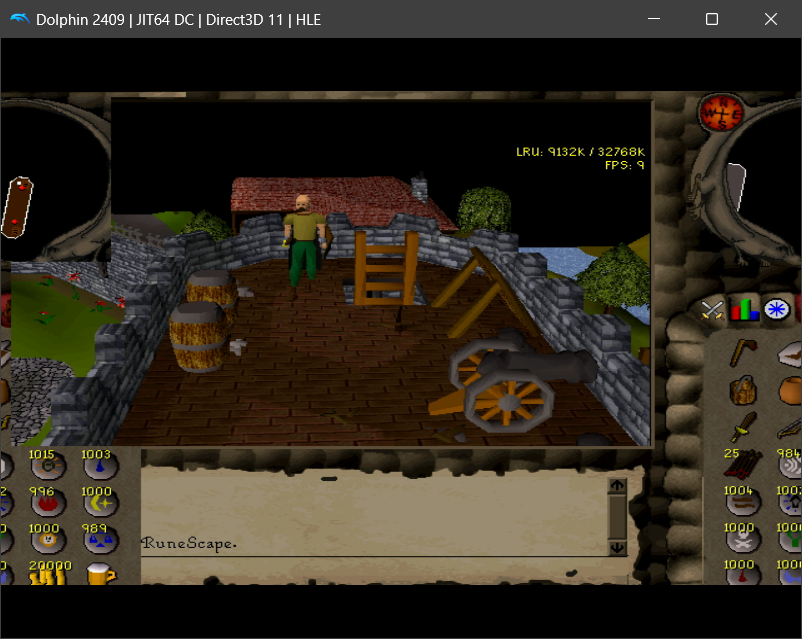
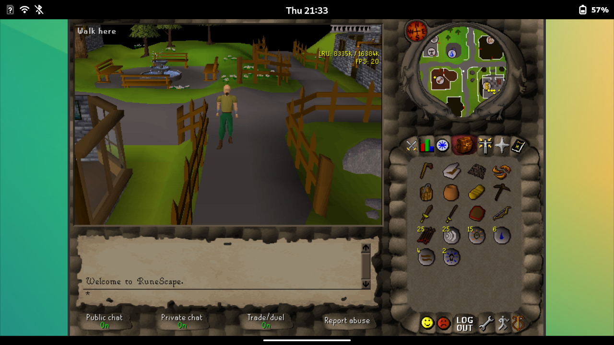

## references
* https://github.com/2003scape/rscsundae - rsa encryption code (C RSC server)
* https://github.com/2003scape/rsc-c - libraries, networking, platform code (C RSC client)
* https://github.com/2004Scape/Client - renamed java deob that this port is based on
* https://github.com/LostCityRS/Client-TS - typescript port that encountered some of the same issues
* https://github.com/RuneWiki/rs-deob - unmodified java deobs

### old
* https://github.com/Pazaz/RS2-225 - renamed java deob with builtin server
* https://github.com/2003scape/rsc-client - bundled webworker/webrtc server idea in Client2 (old TS port)
* https://github.com/2004Scape/Client2 - https://lesleyrs.github.io/Client2/?world=999&detail=high&method=0
* https://github.com/galsjel/RuneScape-317 - partial 317 TS port https://github.com/lesleyrs/webclient317

## game history info
* https://github.com/2004Scape/Server/wiki/FAQ
* https://runescape.wiki/w/Build_number
* https://oldschool.runescape.wiki/w/Graphical_updates_(historical)
* https://oldschool.runescape.wiki/w/User:Hlwys

## Java and C differences + codestyle
```
- errorhost, errorstarted code never runs
- java has 16 bit char, undefined keychar is 0xffff, pound char doesn't fit in ascii
- some keycodes differ from java virtual keycodes
- window insets removed outside of web, (gameframe/viewbox).java replaced with platform dir
- added pix error checking in client_load
- java static class members are added to a separate global struct
- java private static class members are now C global static vars
- for stack allocated arrays/strings we have to check if idx[0] != '\0'
- original unused vars/params casted to (void) to avoid spam with warnings on
- some input (EG client_update_title username/password) is changed to fit C better
- some buffer sizes used are just arbitrary due there not being a strict limit
- try catch turned into if (!var) break in load() or goto is used for login error message
- on windows we aren't loading system gm.dls but use a similar sf2 soundfont instead
- the game uses 3 titles: "RuneScape - the massive online adventure game by Jagex Ltd" (website), "RuneScape Game" (html) and "Jagex" (jar)

- no client_load_archive message for file streaming since the files are fetched all at once
- http requests for checksums/cache (not done as they aren't supposed to change and saving files on consoles depends on if sdcard or romfs was used) another downside is that being "connected" in emulators generally stops you from being able to fast forward so load times will be slow.

- init() moved to main() as that's emscriptens entrypoint
- emscripten wasm goes out of sync on lowmem if the tab was unfocused and tinysoundfont isn't running. The typescript client uses absolute time to avoid this issue, but since tsf is making it work on highmem it's not very important.
- dnslookup on web just shows your public ip instead of dns, this is expected and the same applies to the typescript client. If dnslookup fails to resolve and welcome screen lags you can set `hide_dns = 1` in config.ini to skip it.

- networking/midi/login flames run on the same thread
- synchronized is unused and there's no run() function in client.c
- can't create threads on web without sharedarraybuffer if we wanted to: https://emscripten.org/docs/porting/pthreads.html
- c11 threads aren't supported with sanitizers, valgrind tools, tcc and macos
- no official pthreads on windows, the thirdparty one dropped old windows support?

- int is assumed to be 32 bits, the few uses of shorts are ignored
- use int8_t for java byte arrays, char isn't guaranteed to be signed
- use in64_t for longs as long is 32 bits on windows
- few uses of size_t and other uints for interacting with libs/unsigned bitshift
- *.length checks replaced with *_count vars (EG label_vertices) or *_LENGTH define if it doesn't change
- replaced labelled break/continue with goto
- removed explicit null checks with with var and !var
- prefixed function names with the struct they take as first arg
- signed integer underflow/overflow is undefined (-fwrapv doesn't exist for cl/tcc, but there's no known issue) loopcycle should be ok

- msvc doesn't support VLAs (variable length arrays), use heap allocations
- all the casts to char* and int in clientstream are just to stop windows warnings
- changed camelCase into snake_case, lowercase hex values
- no code width limit as virtual text wrapping is superior for selecting complete lines
- only moved files to dirs with little includes to avoid complicating builds with -I
- outside of SDL3 or TCC the SDL header is exposed on some platforms ONLY to have SDL_main replace entrypoint for subsystem:windows/android etc, don't use it
```
