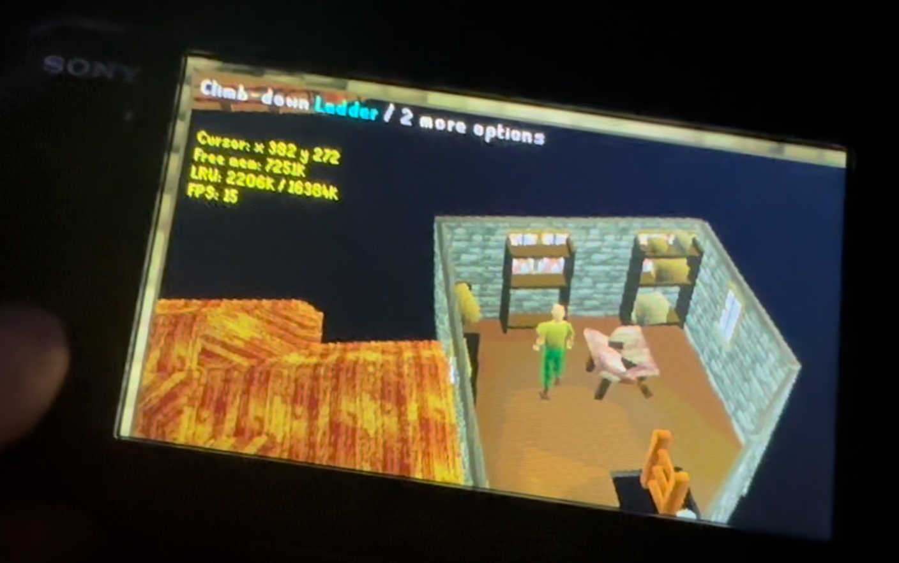

## TODO
```
some platforms don't like it when you call exit() (aka sceKernelExitGame on psp) yourself, need to avoid it?
all consoles except vita expect rsa to be disabled (comment out rsadec in server and set disable_rsa = 1 in config.ini) due to tiny-bignum being too slow and timing out the authentic 30 second socket timer in both server and client.
all consoles without touch need to be able to redraw entire screen (even parts it normally doesn't) due to not having a builtin pointer/cursor to show where your virtual pointer is. This means it will never redraw that part of the screen and will just accumulate those images.
ts Client2/java Client (lastmain/webclient branch) repo have extra funcs (pix2d etc?)
remove original cache at bin/archives when the cache matches exactly
add diskstore/gzip just for later cache loading
SDL3 is not officially released yet, need updated binaries when it is.
icon/metadata/title etc for the different platforms: title+taskbar+desktop
http requests for checksums/cache (not done as they aren't supposed to change and saving files on consoles depends on if sdcard or romfs was used)
change a bunch of functions and function prototypes to static
clientstream and keycodes are based off rsc-c (but both have some tweaks), double check them for accuracy
the following are (partially) based on RS2-225 by accident, some funcs might take args in diff order to Client repo: animbase, animframe, pix2d, pix3d, gameshell, jagfile, model, packet, pix8, pixfont, pixmap. Rewrite maybe?
inconsistent naming: used both world3d and scene for world3d, rename world3d to scene? or at least for args only
COLLISIONMAP_LEVELS should probably be added in some more places
global search TODO and NOTE and all console __defines__
add CI: check both highmem/lowmem, members/free, all entrypoints, run make check/scan/san and clang-format
maybe allow resizing canvas/fullscreen on desktop (draw to sdl texture and use gpu, sdl2 wrapper for sdl1 on linux already does this)
maybe take webworker server compat from Client2: https://emscripten.org/docs/api_reference/wasm_workers.html
bring back worldlist loading in [shell.html](https://github.com/lesleyrs/Client3/commit/5da924b9f766005e82163d899e52a5df2f771584#diff-c878553ed816480a5e85ff602ff3c5d38788ca1d21095cd8f8ebc36a4dbc07ee) if it gets re-added for live servers
```
## Java and C differences + codestyle
```
- errorhost, errorstarted and errorloading code never runs
- no pound character as it doesn't fit in ascii
- window insets removed, (gameframe/viewbox).java replaced with platform dir
- added pix error checking in client_load
- java static class members are added to a separate global struct
- java private static class members are now C global static vars
- for stack allocated arrays/strings we have to check if idx[0] != '\0'
- original unused vars/params casted to (void) to avoid spam with warnings on
- some input (EG client_update_title username/password) is changed to fit C better
- some buffer sizes used are just arbitrary due there not being a strict limit
- try catch turned into if (!var) break in load() or goto is used for login error message
- init() moved to main() as that's emscriptens entrypoint

- networking/midi/login flames run on the same thread
- synchronized is unused and there's no run() function in client.c
- can't create threads on web without sharedarraybuffer if we wanted to: https://emscripten.org/docs/porting/pthreads.html
- c11 threads aren't supported with sanitizers, valgrind tools, tcc and macos
- no official pthreads on windows, the thirdparty one dropped old windows support?

- int is assumed to be 32 bits, the few uses of shorts are ignored
- use int8_t for java byte arrays, char isn't guaranteed to be signed
- use in64_t for longs as long is 32 bits on windows
- few uses of size_t and other uints for interacting with libs/unsigned bitshift
- *.length checks replaced with *_count vars (EG label_vertices) or *_LENGTH define if it doesn't change
- replaced labelled break/continue with goto
- removed explicit null checks with with var and !var
- prefixed function names with the struct they take as first arg
- signed integer underflow/overflow is undefined (-fwrapv doesn't exist for cl/tcc, but there's no known issue) loopcycle should be ok

- msvc doesn't support VLAs (variable length arrays), use heap allocations
- changed camelCase into snake_case, lowercase hex values
- no code width limit as virtual text wrapping is superior for selecting complete lines
- only moved files to dirs with little includes to avoid complicating builds with -I
```
